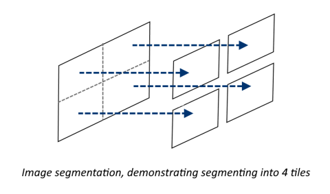
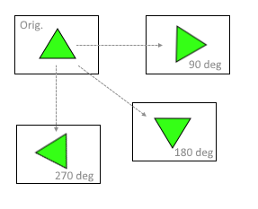

# Custom Vision Parallel Scoring Utility
  
The Azure [Custom Vision service][1] today has [limits][2] on the size of images used for training and scoring. These limits can present challenges to applications which produce high-resolution images as is commonly found in modern high-definition cameras.

In order to work around these current limitations, a sample project will be developed that will demonstrate an approach that breaks down single, high-resolution images into smaller pieces and leverages those to train on and run predictions against. Once scored, the code will re-assemble these individual results back into a single image buffer and combine any object detection bounding boxes.

This approach should work with both classification and object detection methods, making the code reusable for a variety of scenarios.

## Approach

The concept that is leveraged in this repo is the idea of _image segmentation_, where an image is segmented into multiple, smaller parts each of which is a uniformly sized part of the larger, high-resolution source image. Using this idea of segementing, features which may be obscured within the original high-resolution image are thereby augmented within the individual tiles since the relative size of the feature is now much larger (compared to the tile size) - specifically, feature augmentation follows linearly as the number of tiles increases. This augmentation allows easier identification within the model, yielding higher accuracy for features which would normally be much too small:

 
    

In addition, the individual tiles are also duplicated and modified (via rotation about a center origin point) in order to provide additional training images. Each tile is rotated 3 times (90, 180, and 270 degrees) in order to give 4 training images per tile (counting the original):

 
    

Once the images are segmented, they can be used to build a Custom Vision model using the process outlined [here][3]. Optionally, we could also automate the upload and training steps, assuming we have defect coordinates apriori to running the utilities.

Regardless of the method used to build the model, the final step will be to leverage the scoring API of the model in order to identify/classify a source image. The process of scoring an original source images begines much the same way as outlined above, where the source image is segmented into smaller tiles. Each of these tiles is then submitted (in parallel) to the Custom Vision scoring API endpoint, which returns classification and/or object identification bounding box details.

Note, however, that we now have bounding box information that is relative only to a *single tile*. The final steps is to re-map these coordinates (effectively from R4 space to R2 space) so we can "re-map" the boxes back onto the original source image. Once this is done, we can draw these re-mapped boxes onto the source image for display.

## Architecture and Design

Designed as a pre- and post-processing utility, the code is intended to be used from the command line to both generate images used for building / training models, as well as orchestrating parallel calls to those models to score a source image. Details of the application architecture can be found at the links below:

* [Module design and descriptions](docs/module-design.md)
* [Data exchange and temporary file use](docs/data-exchange.md)

## Installation & Setup

This project was developed / tested using Python 3.6.8 along with Pylint3 1.8.3 from a virtual environment created using `venv` ([more info here][4]). `Pip` requirements can be found in the `requirements.txt` file using the following: 

`pip install -r requirements.txt`

Following successful installation, unit tests can be run using the `run-tests.sh` script to verify correct operation.

## Usage

To create a set of training tiles, the basic use will be:

`python src/main.py -t --sourceImage xxx --tilePath xxx --tileWidth xxx --tileHeight xxx`

So, for example, to tile a source image named `test-image.jpg`, save the tiles at `./tiles`, and have each tile be 800x600, use the following (note the `-t` flag):

`python src/main.py -t --sourceImage test-image.jpg --tilePath tiles/ --tileWidth 800 --tileHeight 600`

To run scoring against a source image, the usage is (note the `-s` flag):

`python src/main.py -s --sourceImage xxx --tilePath xxx --tileWidth xxx --tileHeight xxx --outputPath xxx`

This will write the final output image to the path defined by the `--outputPath` parameter.

## Logging

All modules currenly log using the standard Python `logging` module, allowing output to be captured to files, console output, etc. Additional settings and/or output methods may be delivered in later builds.

## Feedback / Issues

Please feel free to submit issues and feedback in this repo - pull requests also accepted.

[1]: https://docs.microsoft.com/en-us/azure/cognitive-services/custom-vision-service/home
[2]: https://docs.microsoft.com/en-us/azure/cognitive-services/custom-vision-service/limits-and-quotas
[3]: https://docs.microsoft.com/en-us/azure/cognitive-services/custom-vision-service/get-started-build-detector 
[4]: https://docs.python.org/3.6/library/venv.html