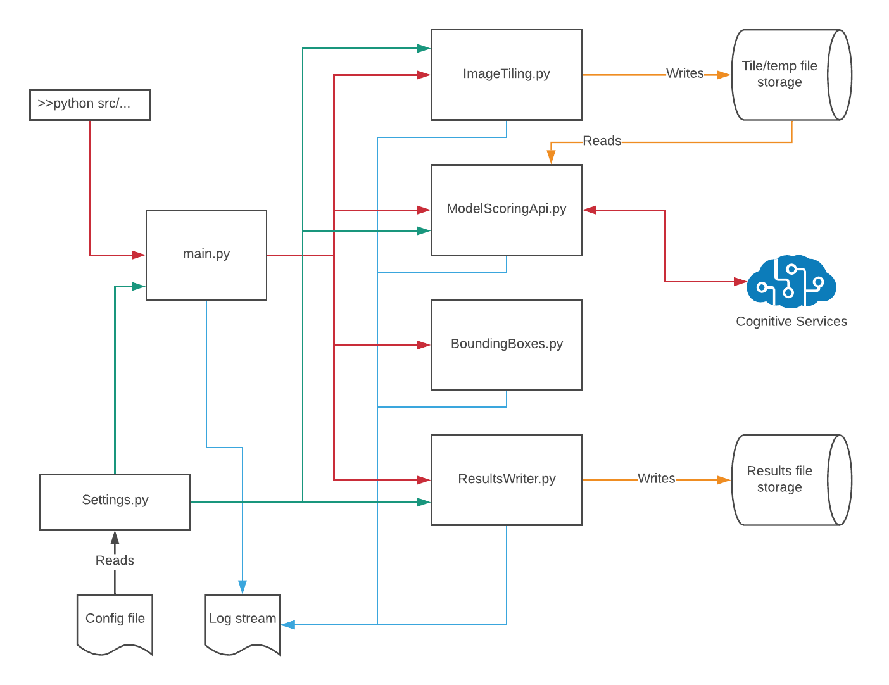

## Module design and descriptions

The following diagram depicts the relationships and dependencies between the source modules:

 
    

A brief description of each module is given below:

* `main.py`: Bootstrapping/entry point, command line argument parsing, and high-level workflow orchestration.
* `ImageTiling.py`: Handles tiling of the source input image into a set of smaller tiles. These tiles are written to a temporary location defined by the `--tilePath` command line argument.
* `ModelScoring.py`: Handles making calls to the CustomVision API service in a non-blocking, parallel manner leveraging Tornado/asyncio coroutines.
* `BoundingBoxes.py`: This module handles mapping of the bounding box coordinates from tile space back to the original source image.
* `ResultsWriter.py`: Handles writing out the final result image with the bounding boxes drawn on it.